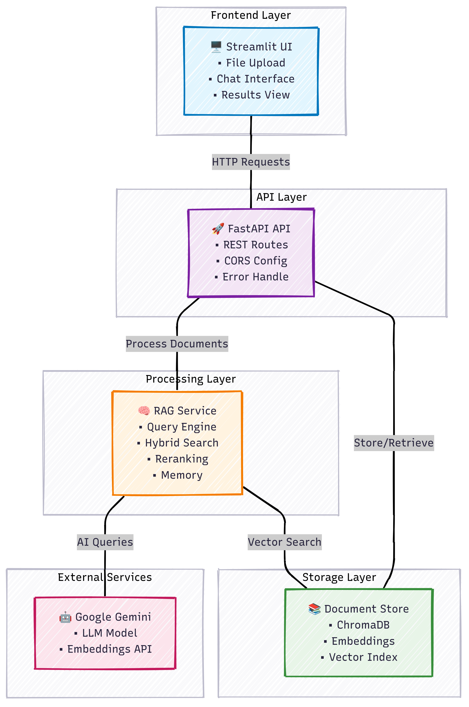

# LegalRAG 🏛️⚖️

> **Advanced Legal Document Intelligence System for Indonesian Financial Services Authority (OJK) Regulations**

A sophisticated Retrieval-Augmented Generation (RAG) system with **Knowledge Graph capabilities** built with FastAPI and Streamlit. This intelligent assistant helps legal professionals, compliance officers, and financial institutions navigate complex OJK regulations and Indonesian financial law through multi-modal document analysis and semantic relationship discovery.

## ✨ Key Features

### 🔍 **Multi-Modal Search & Retrieval**
- **Vector Search**: Semantic similarity using advanced embeddings
- **Graph Search**: Entity-relationship based queries with knowledge graphs
- **Hybrid Search**: Combined vector and graph results for comprehensive answers
- **BM25 Integration**: Keyword-based search with ensemble retrieval

### 📄 **Advanced Document Processing**
- **Multi-format Support**: PDF, TXT, DOCX, MD, and ZIP files
- **Hierarchical Legal Structure**: Intelligent parsing of BAB → BAGIAN → PASAL → AYAT
- **Metadata Enhancement**: Source tracking with page numbers and legal structure
- **Content Deduplication**: Smart duplicate detection and removal

### 🧠 **AI-Powered Intelligence**
- **Context-Aware Q&A**: Natural language queries about legal documents
- **Query Enhancement**: Intelligent query reformulation using conversation history
- **Cross-Encoder Reranking**: Improved result relevance scoring
- **Conversational Memory**: Maintains context across multiple questions

### 🕸️ **Knowledge Graph System**
- **Entity Extraction**: LLM-powered identification of legal entities and concepts
- **Relationship Mapping**: Automatic discovery of connections between legal concepts
- **Semantic Search**: Graph-based query processing with node embeddings
- **Interactive Visualization**: Pyvis-powered graph exploration interface
- **Persistent Storage**: Efficient graph data persistence and loading

### 🌐 **Dual Interface**
- **REST API**: Full-featured API for integration and automation
- **Streamlit Web App**: User-friendly interface for interactive document analysis
- **Real-time Processing**: Fast document indexing and retrieval
- **Source Transparency**: View exact document chunks and graph entities used

## 🏗️ Architecture



### System Components

- **🎯 API Layer**: FastAPI with specialized handlers for uploads, chat, system management, and graph operations
- **🔧 Core Services**: Document processing, RAG orchestration, and model management
- **💾 Storage Layer**: Vector database (ChromaDB) and knowledge graph storage
- **🤖 AI Models**: Gemini 2.5 Flash LLM, text-embedding-004, and cross-encoder reranker

## 🚀 Quick Start

### Prerequisites

- Python 3.8+
- Google Gemini API key ([Get one here](https://ai.google.dev/))
- 8GB+ RAM (recommended for graph processing)
- 2GB+ disk space

### Installation

1. **Clone the repository**
   ```bash
   git clone https://github.com/yourusername/legalrag-ojk.git
   cd legalrag-ojk
   ```

2. **Create virtual environment**
   ```bash
   python -m venv venv
   source venv/bin/activate  # On Windows: venv\Scripts\activate
   ```

3. **Install dependencies**
   ```bash
   pip install -r requirements.txt
   ```

4. **Configure environment**
   ```bash
   # Create .env file
   echo "GEMINI_API_KEY=your_api_key_here" > .env
   ```

5. **Start the system**
   ```bash
   # Terminal 1: Start API server
   python main.py
   
   # Terminal 2: Launch web interface
   streamlit run streamlit_app.py
   ```

6. **Access the application**
   - 🌐 Web Interface: http://localhost:8501
   - 📡 API Documentation: http://localhost:8000/docs
   - 🔍 Health Check: http://localhost:8000/health

## 💡 Usage Guide

### 🌐 Web Interface

1. **📤 Upload Documents**: 
   - Use the sidebar to upload legal documents (PDF/TXT/DOCX/ZIP)
   - Enable graph processing for enhanced semantic analysis
   - Monitor upload progress and statistics

2. **💬 Interactive Chat**:
   - Ask questions in Indonesian or English
   - Choose search mode: Vector, Graph, or Hybrid
   - Toggle enhanced query processing for complex questions

3. **🔍 Explore Results**:
   - View source documents with metadata
   - Explore knowledge graph entities and relationships
   - Visualize document connections

4. **📊 System Monitoring**:
   - Check system health and statistics
   - View chat history and clear conversations
   - Monitor graph processing status

### 📡 API Endpoints

#### Document Management
```bash
# Upload documents with graph processing
curl -X POST "http://localhost:8000/upload" \
  -F "files=@document.pdf" \
  -F "enable_graph_processing=true"
```

#### Intelligent Chat
```bash
# Multi-modal chat with search type selection
curl -X POST "http://localhost:8000/chat" \
  -H "Content-Type: application/json" \
  -d '{
    "question": "Apa persyaratan modal minimum untuk bank digital menurut OJK?",
    "search_type": "hybrid",
    "use_enhanced_query": true
  }'
```

#### Knowledge Graph Operations
```bash
# Get graph statistics
curl -X GET "http://localhost:8000/graph/stats"

# Generate interactive visualization
curl -X POST "http://localhost:8000/graph/visualize"

# Access visualization
open http://localhost:8000/graph/visualize/graph_visualization.html
```

#### System Management
```bash
# Health check with detailed status
curl -X GET "http://localhost:8000/health"

# System statistics
curl -X GET "http://localhost:8000/stats"

# Chat history management
curl -X GET "http://localhost:8000/history"
curl -X POST "http://localhost:8000/clear-history"
```

## ⚙️ Configuration

### Core Settings (`config.py`)

```python
# Model Configuration
LLM_MODEL = "gemini-2.5-flash"           # Primary language model
GRAPH_LLM_MODEL = "gemini-1.5-flash"    # Graph processing model
EMBEDDING_MODEL = "models/text-embedding-004"
RERANKER_MODEL = "cross-encoder/ms-marco-MiniLM-L-12-v2"

# Search & Retrieval
SEARCH_K = 20                            # Initial retrieval count
RERANK_K = 10                           # Final reranked results
VECTOR_WEIGHT = 0.7                     # Vector search weight
BM25_WEIGHT = 0.3                       # Keyword search weight

# Document Processing
CHUNK_SIZE = 1000                       # Text chunk size
CHUNK_OVERLAP = 200                     # Overlap between chunks
MAX_DOCUMENT_SIZE = 10_000_000          # Max file size (10MB)

# Graph Processing
ENABLE_GRAPH_PROCESSING = True          # Enable knowledge graph
GRAPH_STORE_DIRECTORY = 'data/graphstore'
```

### Search Modes

| Mode | Description | Best For |
|------|-------------|----------|
| **Vector** | Semantic similarity search | General questions, concept matching |
| **Graph** | Entity-relationship queries | Complex legal relationships, entity connections |
| **Hybrid** | Combined vector + graph | Comprehensive analysis, multi-faceted questions |

## 🎯 Use Cases

### 👨‍⚖️ Legal Professionals
- Research specific OJK regulations and compliance requirements
- Find precedents and related legal provisions
- Analyze regulatory changes and their implications

### 🏦 Financial Institutions
- Ensure compliance with banking and fintech regulations
- Understand licensing requirements and procedures
- Navigate capital adequacy and risk management rules

### 📊 Compliance Officers
- Monitor regulatory updates and changes
- Conduct compliance gap analysis
- Prepare regulatory reports and documentation

### 🎓 Legal Researchers
- Academic research on Indonesian financial law
- Comparative analysis of regulatory frameworks
- Legal document analysis and annotation

## 🔧 Advanced Features

### 🕸️ Knowledge Graph Capabilities
- **Entity Types**: Automatically detects organizations, regulations, concepts, and legal terms
- **Relationship Discovery**: Identifies connections like "regulates", "requires", "defines"
- **Semantic Embeddings**: Node-level embeddings for similarity search
- **Graph Visualization**: Interactive exploration with Pyvis
- **Incremental Updates**: Efficient graph updates with new documents

### 🎯 Legal Document Understanding
- **Hierarchical Structure**: BAB (Chapter) → BAGIAN (Section) → PASAL (Article) → AYAT (Verse)
- **Cross-References**: Automatic detection of legal citations and references
- **Metadata Enrichment**: Source tracking, page numbers, and structural context
- **Indonesian Legal Terminology**: Optimized for Indonesian legal language

### 🔍 Enhanced Search Features
- **Context-Aware Enhancement**: Query reformulation based on conversation history
- **Multi-Stage Retrieval**: Initial retrieval → reranking → context formation
- **Source Attribution**: Transparent sourcing with document references
- **Confidence Scoring**: Relevance scores for retrieved information

## 🚀 Performance & Scalability

- **⚡ Fast Indexing**: Efficient document processing with parallel operations
- **🔄 Incremental Updates**: Add new documents without full reindexing
- **💾 Memory Optimization**: Efficient memory usage with document streaming
- **📊 Monitoring**: Built-in health checks and performance metrics
- **🔧 Configurable**: Adjustable parameters for different use cases

## 🤝 Contributing

We welcome contributions! Please see our [Contributing Guide](CONTRIBUTING.md) for details.

1. Fork the repository
2. Create a feature branch (`git checkout -b feature/amazing-feature`)
3. Commit your changes (`git commit -m 'Add amazing feature'`)
4. Push to the branch (`git push origin feature/amazing-feature`)
5. Open a Pull Request

## 📄 License

This project is licensed under the MIT License - see the [LICENSE](LICENSE) file for details.

## 🙏 Acknowledgments

- **🦜 LangChain** - RAG framework and document processing
- **🤖 Google Gemini** - Advanced language model capabilities
- **🗄️ ChromaDB** - High-performance vector database
- **🌐 Streamlit** - Interactive web interface framework
- **⚡ FastAPI** - Modern, fast web framework for APIs
- **🕸️ NetworkX & Pyvis** - Graph analysis and visualization
- **🔍 Sentence Transformers** - Semantic embeddings and reranking

---

<div align="center">

**⚖️ Built for Indonesian Legal Professionals | 🏛️ Empowering Financial Compliance**

*© 2024 Rahardi Salim - Advanced Legal Document Intelligence*